# Sensor Monitor

## Table of Contents

- [Requirements](#requirements)
- [Overview](#overview)
- [Message Broker Selection Criteria](#message-broker-selection-criteria)
- [Warehouse Service](#warehouse-service)
- [Message Schema](#message-schema)
- [Docker Usage](#docker-usage)
- [Build and Run](#build-and-run)
- [How to Test](#how-to-test)
- [Benchmarks (Extra Content)](#benchmarks-extra-content)

## Overview
This project is a POC of a system for monitoring sensor data. The considered scenario involves humidity and temperature sensors, present in Warehouses, which receive data from their sensors and send it to a Monitoring Center.
The Monitoring Center receives the data and issues an alarm if the received values are greater than the threshold configured for the respective metric.

The Warehouse Service receives sensor messages via UDP, validates them, and sends them to the broker, which delivers them to the subscribed Central Service.


## Requirements

- Docker with Docker Compose support

## Message Broker Selection Criteria

In the context of this POC, due to the time constraint (less than 24 hours for delivery), to keep it simple, and because these are sensor messages, I chose to use Mosquitto, an MQTT broker. I understand the limitations inherent to this choice, such as the difficulty of horizontally scaling Mosquitto, high-availability configuration, and the management of high volumes of messages. Depending on the non-functional requirements of a real solution, other options could be considered, such as using Kafka.

## Warehouse Service

The Warehouse Service uses two UDP listeners: the Humidity Handler and the Temperature Handler. Each one runs in a Thread, in order to reduce the probability of datagram loss in a scenario with a high sensor data rate. A circular buffer, which stores the received messages, was also added, increasing the system's resilience in case of a temporary failure when sending to the broker.

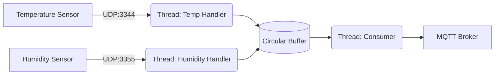

With the adoption of the Circular Buffer, a **graceful shutdown** routine was also added. It tries to send all messages present in the buffer before terminating the application, which happens, for example, during container/pod image updates.

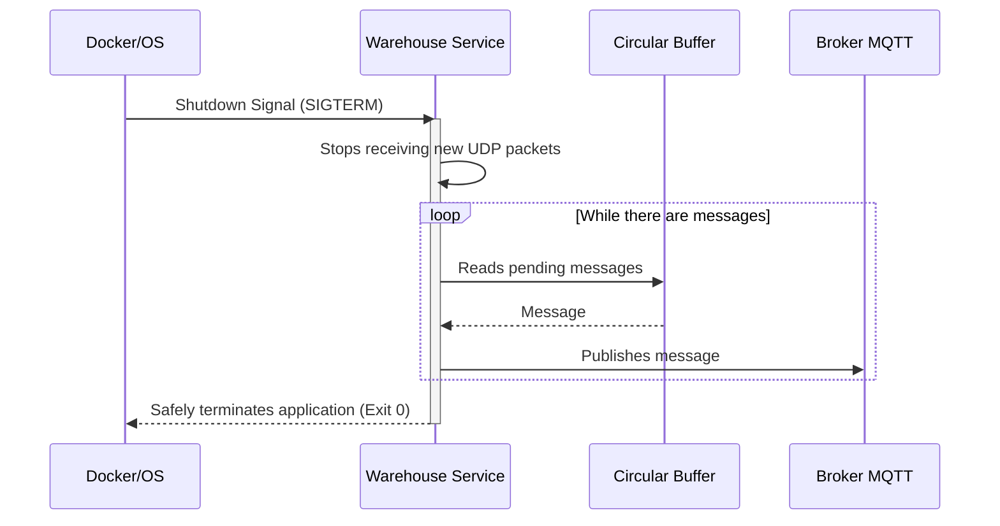

The handlers manipulate the `DatagramSocket` directly. Although there are some libraries that encapsulate the handling of messages received via UDP in Java, such as the Spring Integration UDP adapters, I chose to manipulate them directly to better detail the stages of receiving and handling the UDP packet and the possibilities for specific customizations, such as buffer size, datagram size, etc.

## Message Schema

To ensure that both the Publisher (Warehouse Service) and the Consumer (Central Service) use the same representation of the message object, I created a `message-schema` subproject, which is a Maven artifact and contains the classes used to parse and serialize messages. Since both refer to the same artifact, any change to the message model will be reflected in both projects, Publisher and Consumer.

## Docker Usage

Since I decided to adopt the use of the MQTT broker in the project, to facilitate test execution as well as to better simulate a production environment, I decided to use Docker to run the services individually, so that each service runs in its own container.

When running `docker-compose up -d --build`, the following containers are created and started:
- warehouse
- broker
- central

To stop the services, simply run `docker-compose down`.

## Build and Run

As stated above, to start all services, simply run:
```bash
docker-compose up -d --build
```
To stop the services, simply run:
```bash
docker-compose down
```

## How to Test

Test messages to simulate the sensors can be sent via `netcat`. For a larger volume of messages, I used `nping`, which makes it possible to specify the total quantity and the number of messages per second to be sent.

1. In one terminal, start sending test messages (100 msgs; 1 msg/sec):
```bash
nping --udp -p 3344 -g 50005 --data-string "sensor_id=t29; value=35.5" -c 100 --rate 1 127.0.0.1
```

2. In another terminal, follow the central container's standard output in real time:
```bash
docker logs -f --tail 10 sensor-center
```
- The expected result is similar to this:
```log 
2026-10-06T00:39:07.269Z  WARN 1 --- [center-service] [04-75d9f8ad8daa] c.s.c.AlarmService: ALARM! Warehouse default-warehouse - Sensor t29 exceeded threshold. Value: 35.5
```

## Benchmarks (Extra Content)

After delivering the POC, I decided to run some tests to measure the application's performance and better understand the behavior of the services under high demand. The idea was to perform different stress tests, identifying bottlenecks and instabilities throughout the flow.

For this, I configured an observability stack in a separate branch (`observability`) to monitor the following metrics using Grafana, CAdvisor, Promtail, Loki, and Prometheus:

1. The number of messages sent by the sensors
2. The number of messages dropped by the operating system
3. The number of messages received by the handlers
4. The circular buffer size each second
5. The number of messages dropped because the buffer was full
6. The number of messages consumed from the buffer
7. The number of messages published to the broker
8. The number of messages consumed from the broker by the Central Service

> Disclaimer: The tests below are execution samples. Although I observed similar behavior in other executions with the same parameters, I am aware that several repetitions would be necessary to statistically confirm the observed results.

### Stress Test 1: 2 Sensors, 150k messages at 35k msg/s each

In this test, I simulated 2 sensors, one temperature sensor and one humidity sensor, each sending 150k messages at a rate of 35k+ messages per second. The idea was to verify how a single host of each component behaves under high demand.

Commands executed:
```bash
nping --quiet --udp -p 3344 -g 50009 --data-string "sensor_id=t1; value=10.1" -c 150000 --rate 35000 127.0.0.1 &
nping --quiet --udp -p 3355 -g 50010 --data-string "sensor_id=h10; value=80.5" -c 150000 --rate 35000 127.0.0.1 &
```

#### UDP Messages per second
The graph in [Figure 1](#figura-1) shows the messages received from the sensors by the UDP listeners, represented by the lines:
- Green: Temperature
- Orange: Humidity
- Blue: Temperature + Humidity

This is the first boundary of the Warehouse Service, and we will use this graph as a basis for monitoring the behavior of each stage of the message flow.

Note that each listener was able to support peaks of 35k+ msg/s, reaching a total of 70k+ msg/s in a single Docker container.

<figure id="figura-1">
  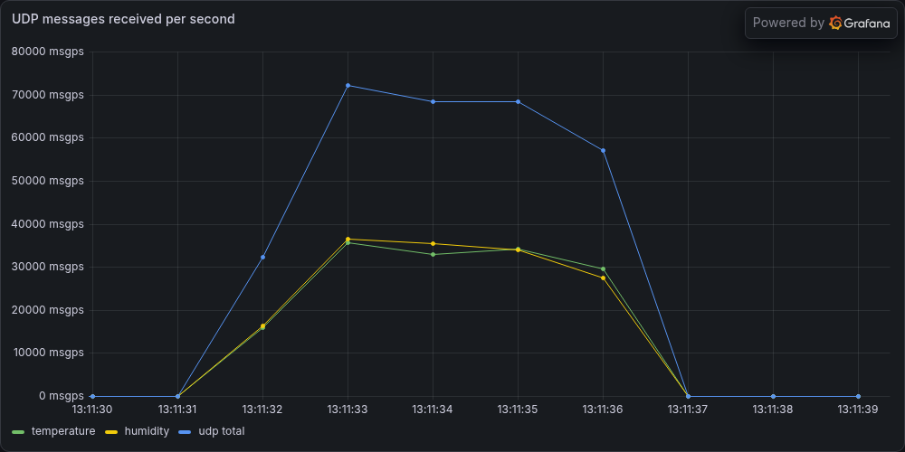
  <figcaption>Figure 1: Graph showing UDP messages received per second. Green: temp; Orange: hum; Blue: temp+hum.</figcaption>
</figure>

#### Warehouse Service Messages per second
The graph in [Figure 2](#figura-2) shows the relationship between messages added to the buffer, messages published to the broker, and messages dropped because the buffer was full. Represented by the lines:
- Green: added to buffer
- Orange: Published to broker
- Blue: dropped (buffer full)

I observed that the message burst started at second `31` and that the buffer consumer managed to keep up with the UDP Listeners at second `34`. The next graph shows details of the buffer size variation over the same time interval.

The peak of messages added to the buffer (green) was 70k+ msg/s, while the publication peak on the broker (orange) was close to 100k msg/s.

<figure id="figura-2">
  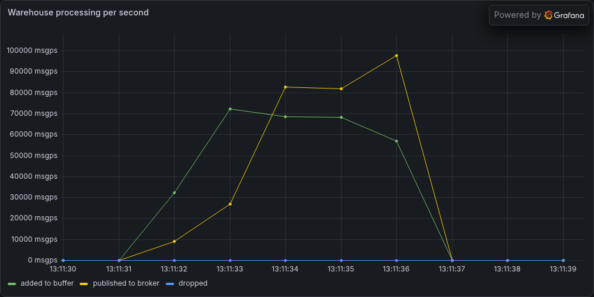
  <figcaption>Figure 2: Relationship between messages received, published, and dropped by the Warehouse Service. Green: added to buffer; Orange: Published to broker; Blue: dropped (buffer full).</figcaption>
</figure>

#### Circular Buffer
The graph in [Figure 3](#figura-3) shows the variation in buffer size over time.
Green: buffer size/second
Orange: dropped/second

Note that there was an increase in the buffer size at the beginning of message reception (second 31) and that the buffer emptied around second 34, when the consumer managed to keep up with the UDP Listeners, as seen in [Figure 2](#figura-2).


<figure id="figura-3">
  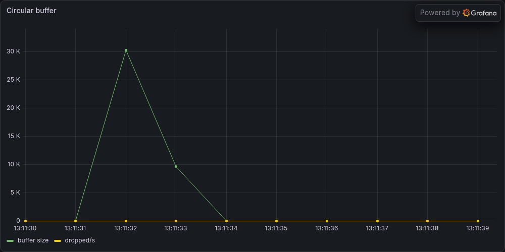
  <figcaption>Figure 3: Warehouse Service Circular Buffer size over time. Green: buffer size/second; Orange: dropped/second.</figcaption>
</figure>

#### Central Service Messages per second
The graph in [Figure 4](#figura-4) shows the internal throughput of the Central Service: messages received via MQTT (green), processed messages (orange), and processing failures (blue).

Since the received and processed lines overlap, the Central Service managed to process practically all messages received within the same measurement interval.

A single Central host was able to handle peaks of 70k msg/s.

<figure id="figura-4">
  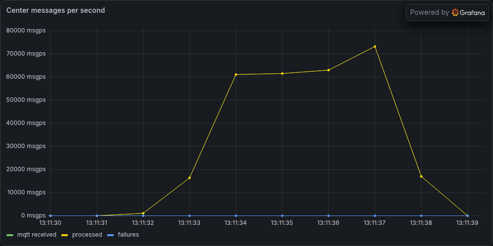
  <figcaption>Figure 4: Central Service throughput. Green: received by Central Service via MQTT; Orange: successfully processed by Central Service; Blue: processing failures.</figcaption>
</figure>

#### Broker Publish Messages per second
This is a complementary graph to the one presented in [Figure 2](#figura-2), which shows the relationship between messages successfully published to the broker (green) and publication failures (orange). Since there were no publication failures, the orange line overlaps the baseline.

<figure id="figura-5">
  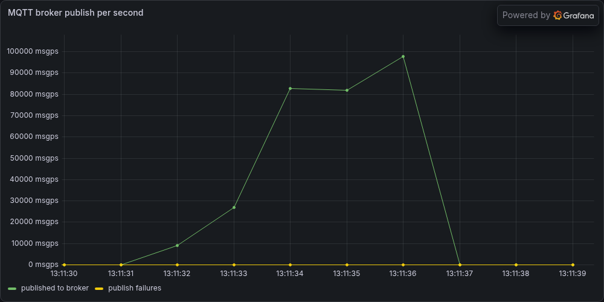
  <figcaption>Figure 5: Relationship between messages successfully published to the broker and failures when publishing to the broker.</figcaption>
</figure>


#### UDP Absolute Messages
The graph below, [Figure 6](#figura-6), shows the cumulative total of messages received via UDP, 300k messages (150k temperature + 150k humidity).

<figure id="figura-6">
  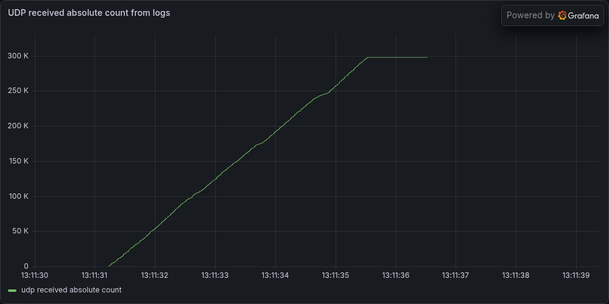
  <figcaption>Figure 6: Cumulative total of messages received via UDP.</figcaption>
</figure>
  
#### Socket Drop Rate

The graph below, [Figure 7](#figura-7), shows the rate of UDP datagrams received by the kernel per second (green) and the rate of UDP datagrams dropped due to receive buffer errors (orange) and other reception errors (blue).

<figure id="figura-7">
  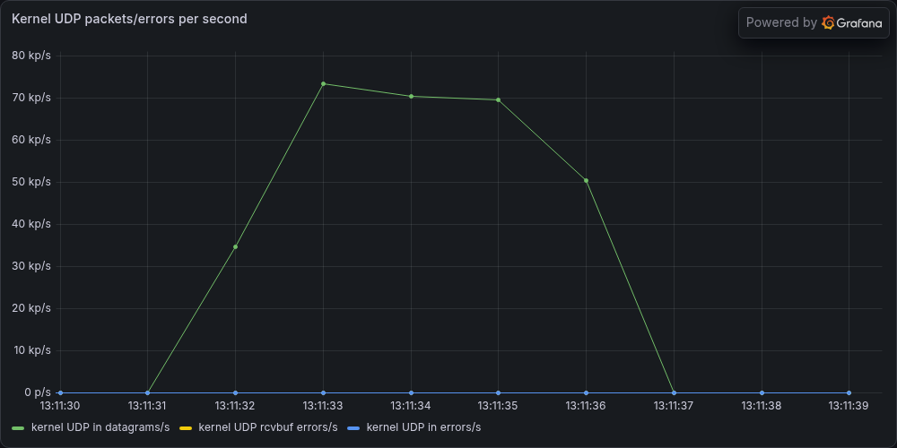
  <figcaption>Figure 7: UDP datagrams received and dropped by the kernel per second. Green: received; Orange: receive buffer errors; Blue: other reception errors.</figcaption>
</figure>

#### Warehouse Cumulative UDP Counters
The graph below, [Figure 8](#figura-8), shows the cumulative total of UDP messages received by the operating system of the Warehouse Service container (green), messages dropped because the OS buffer was full, described as rcvbuf error (orange), and other reception errors (blue).

In this test, no message reception errors were observed in the operating system of the Warehouse Service container.

<figure id="figura-8">
  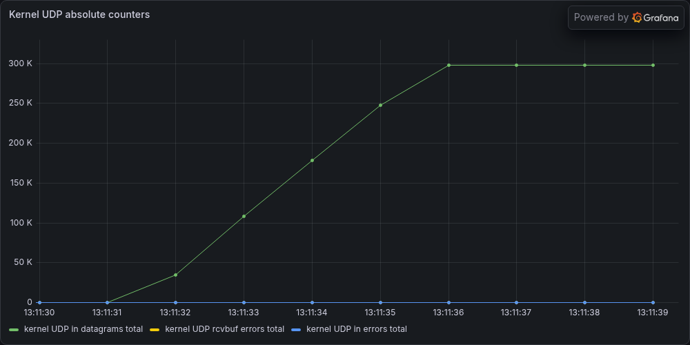
  <figcaption>Figure 8: Cumulative operating-system UDP counters for the Warehouse Service container. Green: received messages; Orange: rcvbuf errors; Blue: other reception errors.</figcaption>
</figure>

### Stress Test 2: 10 Sensors, 300k messages at 15k msg/s each

This test was performed with the intention of collapsing the application. Ten sensors were simulated, each sending 300k messages at a rate of 15k msg/s.

Commands executed:
```bash
nping --quiet --udp -p 3344 -g 50011 --data-string "sensor_id=t1; value=10.1" -c 300000 --rate 15000 127.0.0.1 & 
nping --quiet --udp -p 3344 -g 50002 --data-string "sensor_id=t2; value=50.5" -c 300000 --rate 15000 127.0.0.1 &
nping --quiet --udp -p 3344 -g 50003 --data-string "sensor_id=t3; value=20.5" -c 300000 --rate 15000 127.0.0.1 &
nping --quiet --udp -p 3344 -g 50004 --data-string "sensor_id=t4; value=78.5" -c 300000 --rate 15000 127.0.0.1 &
nping --quiet --udp -p 3344 -g 50005 --data-string "sensor_id=t5; value=30.5" -c 300000 --rate 15000 127.0.0.1 &
nping --quiet --udp -p 3355 -g 50006 --data-string "sensor_id=h6; value=45.5" -c 300000 --rate 15000 127.0.0.1 &
nping --quiet --udp -p 3355 -g 50007 --data-string "sensor_id=h7; value=63.5" -c 300000 --rate 15000 127.0.0.1 &
nping --quiet --udp -p 3355 -g 50008 --data-string "sensor_id=h8; value=12.5" -c 300000 --rate 15000 127.0.0.1 &
nping --quiet --udp -p 3355 -g 50009 --data-string "sensor_id=h9; value=30.5" -c 300000 --rate 15000 127.0.0.1 &
nping --quiet --udp -p 3355 -g 50010 --data-string "sensor_id=h10; value=80.5" -c 300000 --rate 15000 127.0.0.1 &
```

Below are the graphs resulting from this stress test, grouped in a gallery. They are the same as those described in the previous test. Note that the system was unable to support the load of 150k msg/s; even the observability features were temporarily compromised.

Although this immense number of messages for a single node is not expected in a real scenario, we can observe that, despite losing many messages, which was already expected, the system showed resilience and recovered when the load was reduced.


| | |
| :---: | :---: |
| 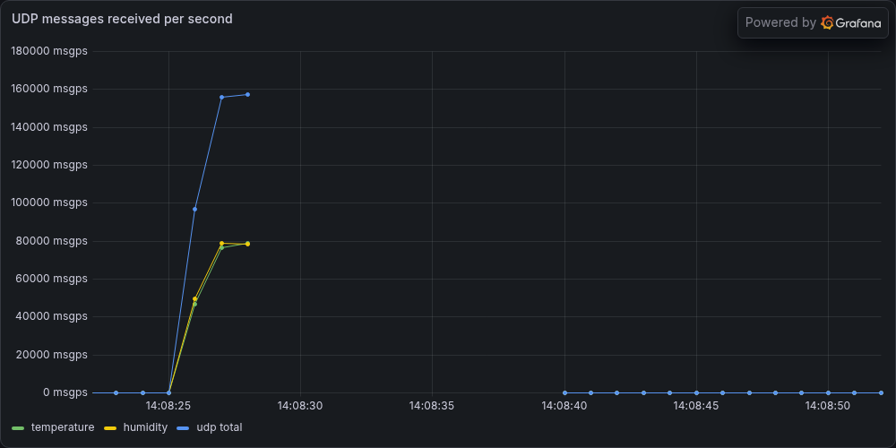 <br> *1. UDP Messages* | 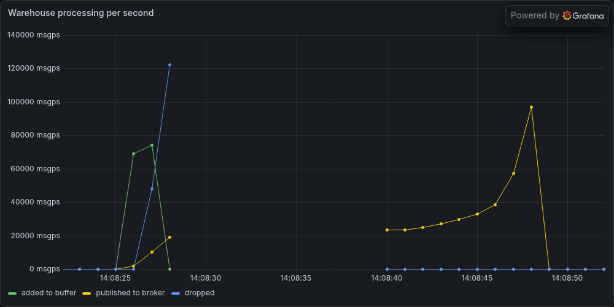 <br> *2. Warehouse Service* |
| 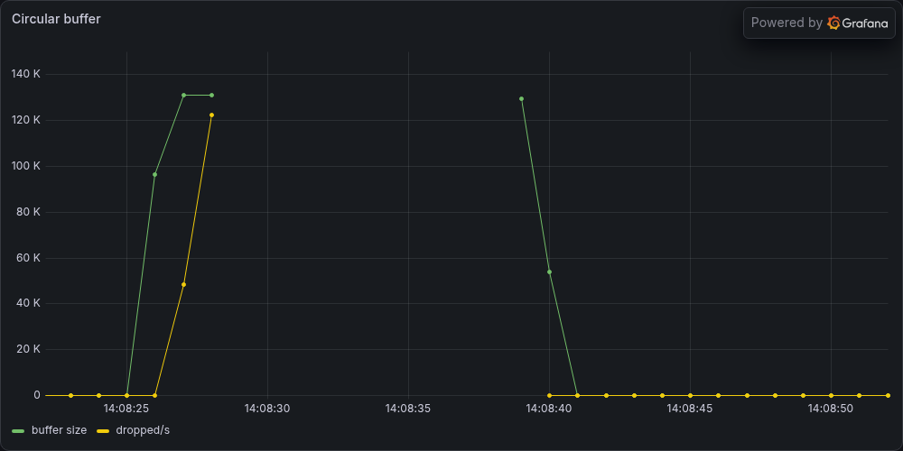 <br> *3. Circular Buffer* | 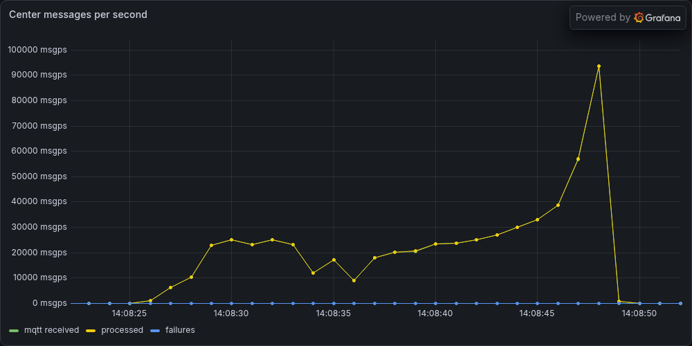 <br> *4. Central Service* |
| 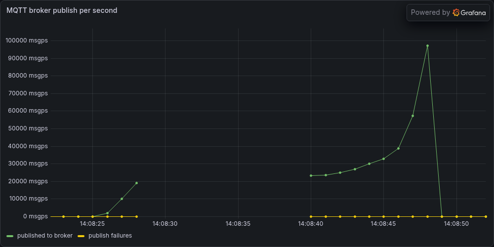 <br> *5. Broker Publish* | 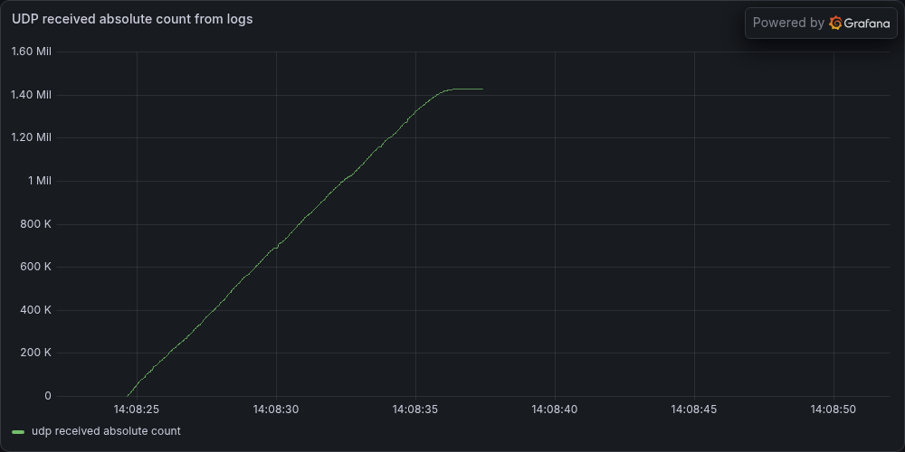 <br> *6. UDP Absolute* |
| 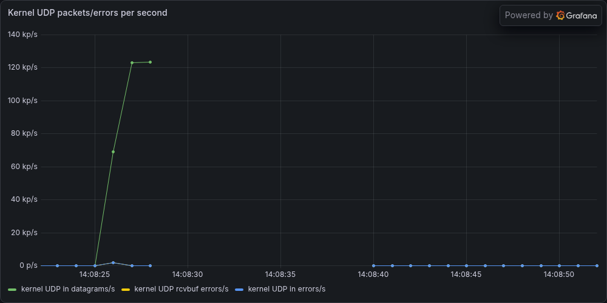 <br> *7. Socket Drops* | 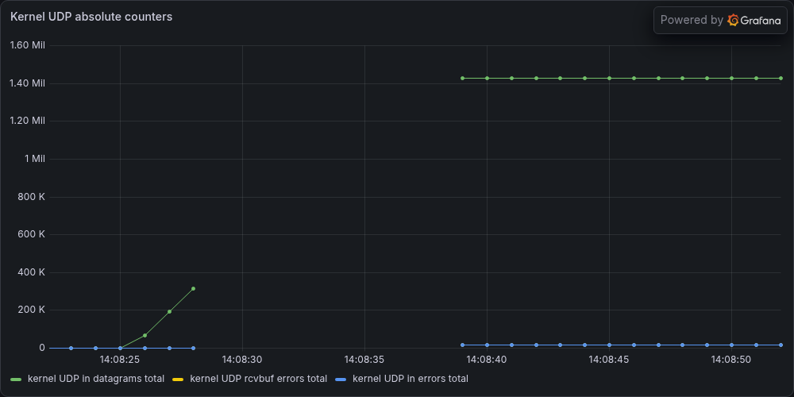 <br> *8. Warehouse Absolute* |


#### Observed Causes of Message Loss

By forcing an overload on the application, I was able to observe that message loss can occur at different stages of the flow.

Since the message flow involves reception via UDP, storage in a circular buffer, consumption from the buffer, sending to the MQTT broker, and consumption from the broker by the Central Service, in a high-performance scenario with a large volume of messages, excluding cases of instability or unavailability, a message can be lost at 3 stages:

1. Before being received by the application, in the Operating System (OS receive buffer overflow). This happens when the handler is processing messages at a much lower rate than the messages sent by the sensors. This happened when I used Docker Desktop on Windows.
2. Before being published to the broker, when the circular buffer is full. This happens when the publisher consumes messages from the buffer at a much lower rate than the rate of messages received by the handlers. In our tests, this error occurred only when the publisher was sending messages synchronously.
3. Before being published to the broker. This can happen when the broker's message receipt confirmation rate is lower than the rate of messages published by the publisher. In the tests, this happened only when messages were published asynchronously and with QoS >= 1, which requires receipt confirmation from the broker. In this case, the broker client has a limit of unconfirmed messages, called maxInFlight; when this limit is reached, the messages are dropped.
